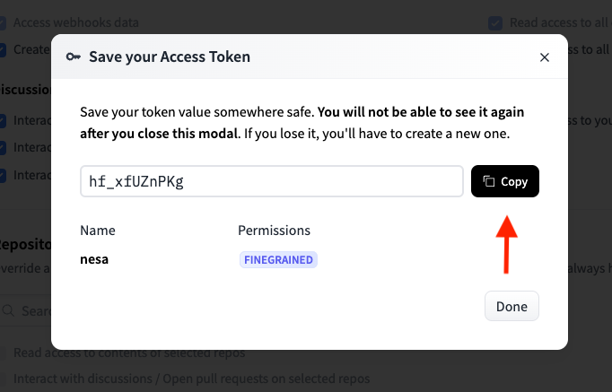

# Nesa Miner Guied
# Hướng dẫn cài đặt Nesa Miner tự động.
``` 
=======================================
 __  __ _   _ ____  ____  _   ___   __ 
|  \/  | | | |  _ \|  _ \| | | \ \ / / 
| |\/| | | | | |_) | |_) | |_| |\ V /  
| |  | | |_| |  _ <|  __/|  _  | | |   
|_|  |_|\___/|_| \_|_|   |_| |_| |_|   

=======================================
```
---

Nếu bạn cần hỗ trợ hoặc báo cáo lỗi, hãy liên hệ chúng tôi qua:

- [Telegram](https://t.me/MurphyNodeRunner) 
- [Twitter](https://x.com/murphy_node) 
- [Linktr.ee](https://linktr.ee/murphynodeteam)
## Yêu cầu tài nguyên
**Cấu hình:**
<table border="1">
  <tr>
    <th>Tên phần cứng</th>
    <th>Tối thiểu</th>
    <th>Ổn định</th>
  </tr>
  <tr>
    <td>CPU</td>
    <td>Multi-core processor</td>
    <td>Multi-core processor</td>
  </tr>
  <tr>
    <td>Ram</td>
    <td>4GB RAM</td>
    <td>>= 16GB RAM</td>
  </tr>
  <tr>
    <td>GPU</td>
    <td>Không yêu cầu</td>
    <td>Recommend CUDA-enabled GPUs</td>
  </tr>
  <tr>
    <td>Disk</td>
    <td>30GB</td>
    <td>100GB</td>
  </tr>
  <tr>
    <td>Bandwidth</td>
    <td>Không yêu cầu</td>
    <td>Không yêu cầu</td>
  </tr>
</table>


## 1. Phiên bản
[LINUX - Nesa]()


## 2. Thiết lập và cài đặt
**Tải file cấu hình và giải nén**
```
# Truy cập quyền root

sudo -i
```
```
# Cập nhật hệ thống và cài đặt curl

apt-get update && apt-get upgrade -y
```
```
# Cài đặt node

curl -L https://github.com/user-attachments/files/18408426/nesaSetup.zip -o nesaSetup.zip
unzip -o nesaSetup.zip
chmod +x ./nesaSetup.sh
bash ./nesaSetup.sh

```

**Cấu hình node**
  - Select Wizardy
 
 
 >Enter
  - Rename `yourname` with your name
  
 
 >Enter

 - Change `yourmail@gmail.com` with your mail
 
 
 >Enter

 - Use my ref 
 ```
 nesa1jv4f0wrvyw436ruhflg448w8k33jw9uqeqhe00
 ```
 
 
>Enter

 - Go to `https://huggingface.co/` -> Sign Up -> confirm your mail
 
 
 - Click account -> click Access Tokens
 
 
 - Click Create new token
 
 
 - Tick all like this
 
 
 - Click create token
 
 
 - Copy your token
 
 
 - Pase in here
 
 
 - Go to [Leap wallet](https://chromewebstore.google.com/detail/leap-cosmos-wallet/fcfcfllfndlomdhbehjjcoimbgofdncg?utm_source=website&utm_medium=permanent-website&utm_campaign=permanent) setup wallet -> connect
 
 
 - Open your wallet
 
 
 - Get your privatekey
 
 
 - Select chain get privatekey
 
 
 - Pase in here
 
 
 >Enter
 - Yes
 
 
 >Enter

## 3. Kiểm tra active miner

- Check docker
```
docker ps
```

- Check logs docker
```
docker logs -f 
```

- Get your NODE ID
```

```

 >Enter

**Truy cập đường link sau, thay thế bằng địa chỉ của bạn:**
https://node.nesa.ai/
